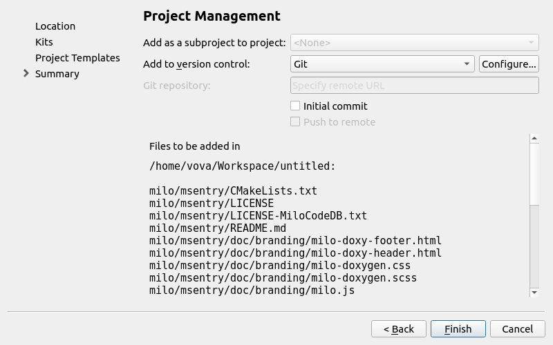

# Installer for Milo Qt Creator wizard

## Overview

The installer installs Milo Code Database as a wizard for the Qt Creator. This means that you can create any projects of Milo Code Database from the Qt Creator.
Also addition plugin will be installed. This plugin is used for pages customization of the Qt Creator wizard.


### Installation

Installation process is very simple and typical. Most important part of the installer is **Component Selection Page** which lists the components available for installation.


* **Qt Creator wizard for Milo Code Database** - the Qt Creator wizard for projects creation by templates of Milo Code Database. 
* **Qt Creator plugins for Milo Code Database** - plugins which are used for customization Summary page of the Qt Creator wizard.

**NOTE**: you must select at least one plugin according to your version of the Qt Creator, otherwise the wizard will not work.

On the license check page, you must accept the terms of the license agreement for the installation to continue.


### Using by the Qt Creator

When installation have completed you can create any projects of Milo Code Database from the Qt Creator, just select **File > New File or Project... > Milo Code Database > Milo Project Templates > Choose**.


Then as usual, specify working directory, set project name and select kits for building a project. After all you will see Project Templates page where you can select required project templates.


Summary page contains several new controls for additional git operations.



On this page you can:

* make initial commit
* add specified repository URL to remote
* push to remote

When you have completed the steps, Qt Creator automatically generates the project with required subprojects, as defined by the wizard and runs selected git operations.


### Locating wizard and plugins

Qt Creator searches for wizards in the shared directory and in the local user's settings directory. Therefore the wizard is located in subdirectories of the following directories:

* $HOME/.config/QtProject/qtcreator/templates/wizards on Linux and macOS
* %APPDATA%\QtProject\qtcreator\templates\wizards on Windows

Plugins will be installed into Qt Creators' user plugin path:

* %LOCALAPPDATA%\QtProject\qtcreator\plugins on Windows Vista and later
* $HOME/.local/share/data/QtProject/qtcreator/plugins on Linux
* $HOME/Library/Application Support/QtProject/Qt Creator/plugins on OS X


## Project Templates

Detailed information about each project template is described [here](https://docs.milosolutions.com/milo-code-db/main/subprojects.html).


## Prebuilt installers
### TODO: add description


## Developing the installer

### Building the installer

To build the installer you need to build binarycreator tool from [here](https://github.com/VMironiuk/installer-framework.git) first. This version of the binarycreator contains some additional operations which are necessary for the proper work of the installer. [README.md](https://github.com/VMironiuk/installer-framework/blob/master/README) file contains detailed instruction how to build Qt Installer Framework, with useful tools such as binarycreator, from sources.
When the binarycreator will be built, get *libMilo.so* (*Milo.dll*) files from [here](TODO: add ref) then put this files into, for example, milo-qtcwizard-installer/packages/com.milosolutions.milo.plugins.4.5.1/data/4.5.1, directory for version of the Qt Creator 4.5.1 (do the same for other versions).
After all go to the root directory of this repository (it's must be milo-qtcreator-wizard-installer directory, if you didn't change the name during cloning) and enter command:
```
PATH_TO_YOUR_BINARYCREATOR/binarycreator -c config/config.xml -p packages MiloInstaller
```


### Documentation branding
### TODO: add description


### Requirements for new modules
### TODO: add description


## License

This project is licensed under the MIT License - see the [LICENSE-MiloCodeDB.txt](LICENSE-MiloCodeDB.txt) file for details
