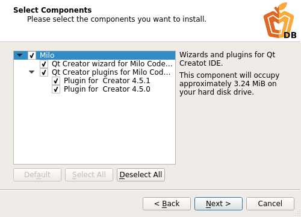

# Installer for Milo Qt Creator wizard

## Overview

The installer installs Milo Code Database as a wizard for the Qt Creator. This means that you can create any projects of Milo Code Database from the Qt Creator.


### Installation

Installation process is very simple and typical. After the installer was running you will see **Introduction Page** which describes about location where whole content of the wizard will be installed.


Then **Component Selection Page** is appear which lists the components available for installation, presently is only **Qt Creator wizard for Milo Code Database** available.



On the license check page, you must accept the terms of the license agreement for the installation to continue.


### Using by the Qt Creator

When installation have completed you can create any projects of Milo Code Database from the Qt Creator, just select **File > New File or Project... > Milo Code Database > Milo Project Templates > Choose**.


Then as usual, specify working directory, set project name and select kits for building a project. After all you will see Project Templates page where you can select required project templates.


### TODO: add description about custom summary page with additional operations for git

When you have completed the steps, Qt Creator automatically generates the project with required subprojects, as defined by the wizard.


### Locating wizard

Qt Creator searches for wizards in the shared directory and in the local user's settings directory. Therefore the wizard is located in subdirectories of the following directories:

* $HOME/.config/QtProject/qtcreator/templates/wizards on Linux and macOS
* %APPDATA%\QtProject\qtcreator\templates\wizards on Windows


## Project Templates

Detailed information about each project template is described [here](https://docs.milosolutions.com/milo-code-db/main/subprojects.html).


## Prebuilt installers
### TODO: add description


## Developing the installer

### Building the installer

To build the installer you need to build binarycreator tool from [here](https://github.com/VMironiuk/installer-framework.git) first. This version of the binarycreator contains some additional operations which are necessary for the proper work of the installer. [README.md](https://github.com/VMironiuk/installer-framework/blob/master/README) file contains detailed instruction how to build Qt Installer Framework, with useful tools such as binarycreator, from sources.
Wnen the binarycreator will be built, go to the root directory of this repository (it's must be milo-qtcreator-wizard-installer directory, if you didn't change the name during cloning) and enter command:
```
PATH_TO_YOUR_BINARYCREATOR/binarycreator -c config/config.xml -p packages MiloInstaller
```


### Documentation branding
### TODO: add description


### Requirements for new modules
### TODO: add description


## License

This project is licensed under the MIT License - see the [LICENSE-MiloCodeDB.txt](LICENSE-MiloCodeDB.txt) file for details